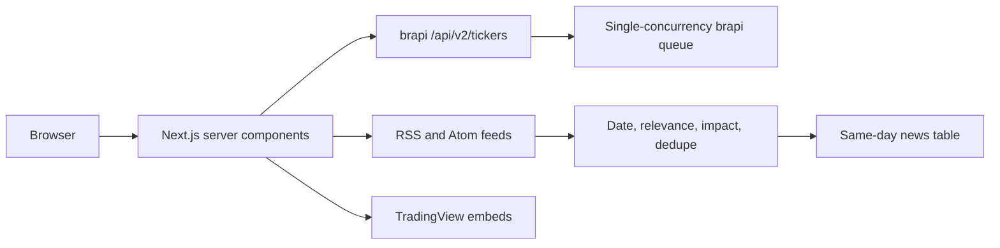

# OpenStock B3 — data and architecture

OpenStock currently exposes a server-rendered dashboard rather than a public REST API. Data acquisition lives in Next.js server actions and external widgets.

## Active request flow



## brapi integration

Implementation: `lib/actions/finnhub.actions.ts`.

The filename is retained for compatibility, but the active quote/search provider is brapi.

| Function | Boundary | Cache | Failure behavior |
|---|---|---:|---|
| `searchStocks(query?)` | `GET /api/v2/tickers` | 15 min | logs and returns no results |
| `getQuote(symbol)` | `GET /api/v2/stocks/quote` | no-store | logs and returns `null` |
| `getCompanyProfile(symbol)` | `GET /api/v2/stocks/quote` | no-store | logs and returns `null` |
| `getWatchlistData(symbols)` | batched stock quote | no-store | logs and returns no rows |

All brapi calls share a process-wide request queue because the observed public contract permits one concurrent request. `BRAPI_API_TOKEN` is sent as a bearer token when configured.

No unavailable value is replaced with a synthetic quote.

## Market-news integration

Acquisition: `lib/actions/market-news.actions.ts`.
Parsing and ranking: `lib/market-news.ts`.

### Sources

- Bloomberg — Google News query scoped to `bloomberg.com`
- Reuters — Google News query scoped to `reuters.com`
- Valor Econômico — Google News query scoped to `valor.globo.com`
- InfoMoney — native RSS
- Banco Central — official Atom feed
- Agência Brasil Economia — native RSS

### Admission rules

An article is shown only when all conditions pass:

1. valid RSS/Atom record;
2. valid HTTP(S) URL and publication date;
3. publication day equals today in `America/Sao_Paulo`;
4. timestamp is not more than one hour in the future;
5. headline/summary matches a configured market-signal group;
6. headline is not on the exclusion list;
7. URL/title has not already been selected.

The output is ordered newest-first and capped by publisher concentration. Impact is a deterministic function of category strength, title match, provider rank, secondary signals, and recency.

### Resource bounds

- 10-second timeout per feed;
- 1.5 MB maximum XML response;
- five-minute Next.js revalidation;
- 30 output items maximum;
- eight items maximum per publisher.

## TradingView integration

Widget configuration lives in `lib/constants.ts`. All active symbols use the `BMFBOVESPA` exchange prefix. The product embeds:

- market overview;
- B3 hot lists;
- selected quotes;
- symbol info;
- daily and baseline charts;
- technical analysis;
- company profile;
- financial statements.

The iframe containers are intentionally inert and ignore pointer input so no click can navigate outside OpenStock.

## Optional sentiment

`ADANOS_API_KEY` enables the stock sentiment card. Without the key, stock details remain functional and simply omit the optional card.

## Legacy server modules

The repository still contains an Inngest route, MongoDB persistence, alerts, Kit, and email modules inherited from the upstream architecture. They are not required by the current dashboard or its no-login flow. See issue [#98](https://github.com/Open-Dev-Society/OpenStock/issues/98) before extending these modules.

## Environment

See [`.env.example`](./.env.example) and [`README.md`](./README.md).

## Verification

```bash
npm test
npm run build
npx eslint \
  components/Header.tsx \
  components/MarketTickerStrip.tsx \
  components/MarketNewsGrid.tsx \
  lib/market-news.ts \
  lib/actions/market-news.actions.ts
```

For known repository-wide legacy diagnostics, see [`docs/HANDOFF.md`](./docs/HANDOFF.md).
