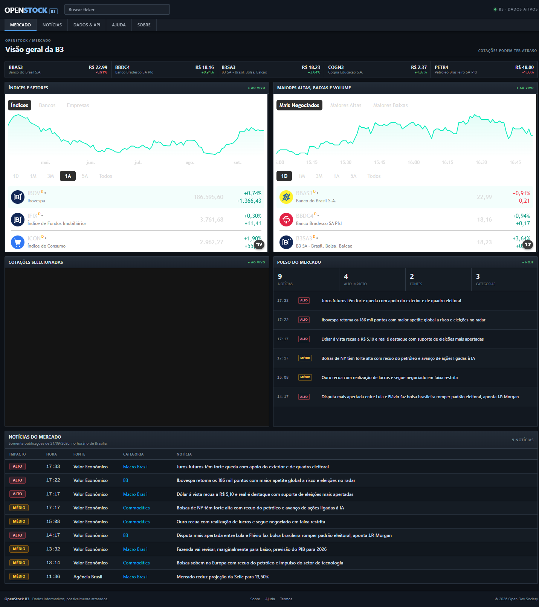

<p align="center">
  
</p>

# OpenStock B3

OpenStock is a local-first, open-source market dashboard focused on instruments traded on **B3**. The current interface uses a compact, information-dense visual language inspired by Finviz while preserving OpenStock's identity and AGPL-3.0 license.

> OpenStock is not a broker and does not provide financial advice. Provider data can be delayed, incomplete, or subject to licensing and rate limits.



## Current product

- Public local dashboard — no login or account required.
- Real B3 ticker search and quote snapshots from [brapi.dev](https://brapi.dev/).
- TradingView panels configured exclusively for `BMFBOVESPA` symbols.
- Compact quote strip and stock-detail terminal views.
- Same-day market-news feed in the `America/Sao_Paulo` timezone.
- News relevance categories for B3, Brazilian macro, listed companies, commodities, and global markets.
- Deterministic impact labels: `Alto`, `Médio`, and `Baixo`.
- RSS/Atom sources: Bloomberg and Reuters through publisher-scoped Google News queries, Valor Econômico, InfoMoney, Banco Central, and Agência Brasil.
- No outbound navigation from the product UI. News is informational and embedded widgets are intentionally non-interactive.

## Stack

- Next.js 15 App Router and React 19
- TypeScript
- Tailwind CSS 4
- TradingView embedded widgets
- brapi.dev REST API
- `fast-xml-parser` for RSS and Atom feeds
- Vitest and ESLint

Legacy MongoDB, Inngest, alert, and email modules remain in the repository but are not required by the current dashboard. Their consolidation or removal is tracked in [issue #98](https://github.com/Open-Dev-Society/OpenStock/issues/98).

## Quick start

### Requirements

- Node.js 20 or newer
- npm
- Internet access for live B3 data, news feeds, and TradingView widgets

### Install and run

```bash
git clone https://github.com/Open-Dev-Society/OpenStock.git
cd OpenStock
npm install
cp .env.example .env   # optional on Windows; copy manually if needed
npm run dev
```

Open <http://localhost:3000>.

The core dashboard works without credentials. A brapi token is optional and can increase provider availability depending on the active brapi plan.

## Environment variables

| Variable | Required | Purpose |
|---|---:|---|
| `BRAPI_BASE_URL` | No | brapi host; defaults to `https://brapi.dev` |
| `BRAPI_API_TOKEN` | No | Optional brapi bearer token |
| `ADANOS_API_KEY` | No | Optional stock sentiment card |
| `ADANOS_API_BASE_URL` | No | Optional Adanos host override |
| `NEXT_PUBLIC_FINNHUB_API_KEY` | No | Legacy company-news path used only by dormant workflows |

See [`.env.example`](./.env.example).

## Data pipeline

### Quotes and search

`lib/actions/finnhub.actions.ts` keeps its historical filename but now uses brapi:

- `GET /api/v2/tickers` for public search, popular symbols, and quote summaries;
- `GET /api/v2/stocks/quote` for explicit symbol snapshots when credentials permit;
- a process-wide request queue enforces brapi's single-concurrent-request limit;
- missing fields stay unavailable rather than receiving fabricated values.

### News

`lib/actions/market-news.actions.ts` fetches curated public RSS/Atom feeds. `lib/market-news.ts` then:

1. validates HTTP/XML input and publication timestamps;
2. accepts only the current São Paulo calendar day;
3. removes stale, future-dated, irrelevant, and duplicate headlines;
4. classifies each item by market topic;
5. computes a deterministic impact label;
6. orders the feed newest-first;
7. limits publisher concentration.

The feed refresh cache is five minutes. Publisher names, timestamps, and headlines come from the upstream feeds; no article text is generated.

### TradingView

TradingView supplies the overview, hot lists, quotes, charts, technicals, profiles, and financial statements. Symbols are normalized to `BMFBOVESPA:<TICKER>`. The embeds remain visible but are inert so the local product cannot navigate users to an external site.

## Commands

```bash
npm run dev       # development server
npm test          # Vitest suite
npm run lint      # repository ESLint
npm run build     # production build
npm start         # serve the production build
```

## Project map

```text
app/(root)/page.tsx                 terminal dashboard
app/(root)/stocks/[symbol]/page.tsx stock details
components/Header.tsx               compact terminal shell
components/MarketTickerStrip.tsx    real B3 quote strip
components/MarketPulsePanel.tsx     same-day market pulse
components/MarketNewsGrid.tsx       same-day news table
components/TradingViewWidget.tsx    inert market embeds
lib/actions/finnhub.actions.ts      brapi server actions
lib/actions/market-news.actions.ts  live feed acquisition
lib/market-news.ts                  parsing, filtering, ranking
lib/constants.ts                    B3 widget configurations
__tests__/market-news.test.ts       timezone/filter/dedupe coverage
docs/HANDOFF.md                     implementation handoff
```

## Verification baseline

The current handoff was verified with:

- 81 passing tests; 4 credential-gated tests skipped;
- focused ESLint checks for the changed product surface;
- successful Next.js production build;
- browser checks for the dashboard, PETR4 details, same-day news, real quote cards, blocked outbound navigation, and inert widgets;
- `git diff --check`.

Repository-wide `npm run lint` and `npx tsc --noEmit` still expose legacy issues outside the active dashboard. Cleanup is tracked in [issue #98](https://github.com/Open-Dev-Society/OpenStock/issues/98).

## Roadmap

- [#95 — Native B3 screener inspired by Finviz](https://github.com/Open-Dev-Society/OpenStock/issues/95)
- [#96 — B3 sector map and market breadth](https://github.com/Open-Dev-Society/OpenStock/issues/96)
- [#97 — Finviz-style news filters and clustering](https://github.com/Open-Dev-Society/OpenStock/issues/97)
- [#98 — Resolve dormant auth/MongoDB/watchlist/Inngest architecture](https://github.com/Open-Dev-Society/OpenStock/issues/98)
- [#86 — Pluggable market-data source](https://github.com/Open-Dev-Society/OpenStock/issues/86)

## License and attribution

OpenStock is licensed under **AGPL-3.0**. See [LICENSE](./LICENSE).

Data and interface integrations retain their own provider terms. The news-feed curation approach was informed by the AGPL-3.0 [WorldMonitor](https://github.com/koala73/worldmonitor) finance variant. TradingView and brapi.dev remain the authoritative providers for their respective data surfaces.

Original project: Open Dev Society and its contributors.
